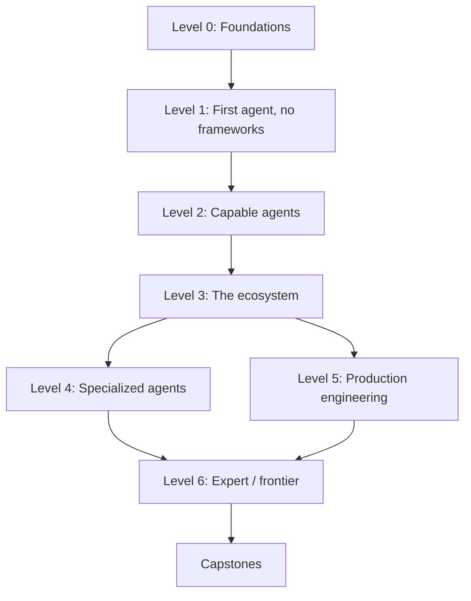

# Roadmap

The full path from zero to expert. Each level builds on the last -- don't skip
ahead, even if a topic sounds familiar, because later labs reuse earlier code
verbatim (the Level 1 agent loop becomes the Level 2 memory lab's base, becomes the
Level 3 multi-agent worker, and so on).

Time estimates assume ~5-8 hours/week and are for the *full* track (see
[HOW_TO_USE.md](HOW_TO_USE.md) for faster tracks). Difficulty: ★ (gentle) to ★★★★★
(expert).

## Level 0 -- Foundations (★, ~1-2 weeks)

| # | Module | You'll learn |
|---|---|---|
| 00 | Programming prerequisites | Python essentials, JSON, HTTP/REST, async, git, venvs, terminal |
| 01 | How LLMs work | Tokens, context windows, sampling, embeddings, reasoning models, hallucination |
| 02 | Talking to LLMs | Messages/roles, streaming, structured outputs, prompt engineering basics, cost/latency |

## Level 1 -- Your first agent, no frameworks (★★, ~2-3 weeks)

| # | Module | You'll learn |
|---|---|---|
| 03 | Tool use / function calling | Schemas, execution, error handling |
| 04 | The agent loop from scratch | Observe→think→act, stopping conditions, ReAct |
| 05 | Context engineering | Window budgeting, tool descriptions, compaction, context rot |
| 06 | Retrieval & agentic RAG | Chunking, embeddings, hybrid search, reranking, agent-driven retrieval |

**Project:** research assistant with citations.

## Level 2 -- Capable agents (★★★, ~2-3 weeks)

| # | Module | You'll learn |
|---|---|---|
| 07 | Memory & state | Short/long-term, episodic/semantic, checkpoint & resume |
| 08 | Planning & reasoning patterns | Plan-and-execute, reflection, routing, orchestrator-workers, evaluator-optimizer |
| 09 | Human-in-the-loop | Approvals, interrupts, escalation, HITL UX |

**Project:** customer-support agent with escalation.

## Level 3 -- The ecosystem (★★★, ~3-4 weeks)

| # | Module | You'll learn |
|---|---|---|
| 10 | Protocols | MCP (server + client), A2A, Agent Skills |
| 11 | Frameworks | The same reference agent built in all 9 major current frameworks + how to choose |
| 12 | Multi-agent systems | Supervisor, hierarchical, handoffs, swarm, debate, failure modes |

**Projects:** MCP server for a real public API; multi-agent content pipeline.

## Level 4 -- Specialized agents (★★★★, ~3-4 weeks)

| # | Module | You'll learn |
|---|---|---|
| 13 | Coding agents | Sandboxed execution, repo navigation, test-driven agent loops |
| 14 | Browser & computer-use agents | Screenshots vs. accessibility tree, reliability tricks |
| 15 | Voice & multimodal agents | Realtime audio concepts, vision inputs, latency budgets |

**Project:** data-analysis agent with a code sandbox.

## Level 5 -- Production engineering (★★★★, ~3-4 weeks)

| # | Module | You'll learn |
|---|---|---|
| 16 | Evaluation | Golden datasets, LLM-as-judge, trajectory evals, public benchmarks |
| 17 | Observability & debugging | Tracing, OpenTelemetry GenAI conventions, replay, cost dashboards |
| 18 | Security & safety | Prompt injection, least privilege, OWASP LLM/Agentic Top 10, red-teaming |
| 19 | Deployment & scale | Streaming APIs, durable execution, caching, rate limits, cost optimization |

## Level 6 -- Expert / frontier (★★★★★, ~4-6 weeks)

| # | Module | You'll learn |
|---|---|---|
| 20 | Optimizing agents | DSPy prompt/weight optimization, distillation, local models |
| 21 | RL and training for agents | RLVR, environment design, reward hacking |
| 22 | Long-horizon & autonomous agents | Multi-hour tasks, self-verification, agent reliability math |
| 23 | Research literacy | Reading and reproducing agent papers |
| 24 | Becoming a pro | Portfolio, open-source contribution, system-design interviews, ethics |

## Capstones (★★★★★, ~2-4 weeks each)

1. **Production coding agent** -- fixes issues in a sample repo, scored on a held-out test set.
2. **Multi-agent research system** -- with evals, tracing, and cost limits.
3. **Secure enterprise agent** -- MCP tools, human approval gates, red-team report.

Each capstone ships with a spec, architecture doc, eval suite, threat model, and
deploy guide -- the artifacts a real team would expect, not just code.

## After this

`system-design/` has case studies and interview prep drawn from Modules 12, 16, 18,
22, and 24. `papers/` has an annotated, verified reading list to keep going past
this repo. `cheatsheets/` has one-page references for quick lookup once you're
building for real.
